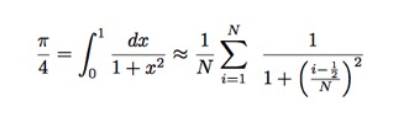

# This repo hold codes for teaching parallel codes

**top level directory contains:**
- serial numerical integration in fortran that produces value of pi
- corresponding OpenMP code
- MPI code
- hybrid code
- some hello codes in C
- corresponding PBS scripts (for use on Imperial College cluster)

Build executables with:

`module load intel-suite mpi; make`

**python directory contains:**
- serial python code
- multiprocessing with pool
- MPI for Python implementation
- just-in-time compilation with numba
- parallel just-in-time with numba
- corresponding PBS scripts

For Python dependencies, follow:

https://numba.pydata.org/numba-doc/latest/user/installing.html

https://anaconda.org/conda-forge/pypy 

https://anaconda.org/anaconda/mpi4py

